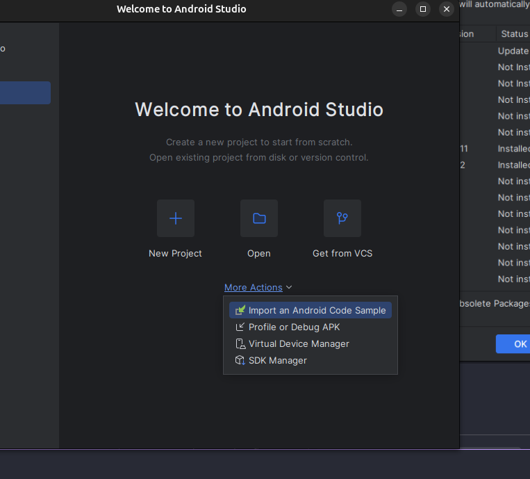
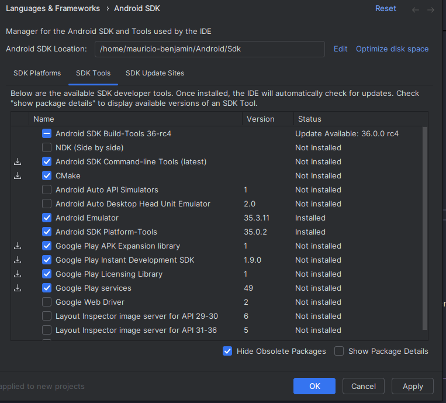

# Aprendendo Flutter no Linux Ubuntu

Para configurar o `Flutter` para trabalhar em diferentes versões, usaremos o [puro](https://puro.dev/).

## Passos para Configuração

- Instalar o `puro` usando este link fornecido pela doc `curl -o- https://puro.dev/install.sh | PURO_VERSION="1.4.8" bash`
- **Caso não tenha o git** use `sudo apt install git`
- use o comando `source ~/.profile` para atualizar o PATH do seu sistema
- Feche e abra seu terminal novamente
- Use o comando `puro flutter doctor` para instalar a ultima versão estável do flutter

A baixo estão alguns comandos que o [puro](https://puro.dev/) oferece para gerenciar o flutter.

```bash
# Create a new environment "foo" with the latest stable release
puro create foo stable

# Create a new environment "bar" with with Flutter 3.13.6
puro create bar 3.13.6

# Switch "bar" to a specific Flutter version
puro upgrade bar 3.10.6

# List available environments
puro ls

# List available Flutter releases
puro releases

# Switch the current project to use "foo"
puro use foo

# Switch the global default to "bar"
puro use -g bar

# Remove puro configuration from the current project
puro clean

# Delete the "foo" environment
puro rm foo

# Run flutter commands in a specific environment
puro -e foo flutter ...
puro -e foo dart ...
puro -e foo pub ...
```

Para saber mais sobre o `puro`, clique [aqui](https://puro.dev/reference/manual/)

## Instale o Android Studio

No meu caso, bastou uma instalação padrão, mas caso eu encontre bons vídeos, vou deixa-los nesta seção

[How to Install Flutter on Ubuntu 24.04 LTS Linux | Android Studio](https://www.youtube.com/watch?v=mtqTnGAAHw0)



- `sdkmanager --install "cmdline-tools;latest`

## Comandos Base

- Crie um projeto flutter usando `flutter create NOME_DO_SEU_PROJETO`

## Estrutura de um Projeto Flutter

Quando criamos um projeto flutter usando ``flutter create NOME_DO_SEU_PROJETO``, o flutter gera uma estrutura de arquivos e diretórios para auxiliar no desenvolvimento. Vamos discutir sobre essa estrutura

```bash
NOME_DO_SEU_PROJETO/
    .dart_tool/
    .ideia/
    android/
    ios/
    lib/
    linux/
    macos/
    test/
    web/
    widows/
    .gitignore
    .metadata
    analysis_options.yaml
    core.iml
    pubspec.lock
    pubspec.yaml
    README.md
```

Objetivo de cada pasta se resume a:

- `build/`: Todo o código gerado pelo flutter para a distribuição desejada ficará nesta pasta
- `lib/` Todo nosso código da aplicação em dart ficará nesta pasta´
- `test/`Todos os seus testes devem ficar nesta pasta.
- `pubspec.yaml` Configuração de dependências e versões do projeto.

## Executando o Projeto

Para executar seu projeto, acesse usando `cd NOME_DO_SEU_PROJETO` e use o comando `flutter run`

Se você preferir, pode executar seu projeto somente na plataforma desejada como no android studio usando `flutter run -d android`

Caso o emulador não esteja associado como padrão, você verá algo parecido com o bloco a baixo

```bash
mauriciobenjamin700@mauriciobenjamin700-Latitude-5300:~/projects/my/flutter-learning/core$ flutter run -d android
No supported devices found with name or id matching 'android'.

The following devices were found:
sdk gphone64 x86 64 (mobile) • emulator-5554 • android-x64    • Android 15 (API 35) (emulator)
Linux (desktop)              • linux         • linux-x64      • Ubuntu 24.04.1 LTS 6.8.0-51-generic
Chrome (web)                 • chrome        • web-javascript • Google Chrome 132.0.6834.159
```

use `flutter run -d emulator-5554` trocando `emulator-5554` pelo id do seu emulador que aparecer.

Você pode usar `R` no terminal para dar um `reload` no seu app.

Algumas teclas que podem ser usadas no terminal enquanto o app está em execução:

- r Hot reload. 🔥🔥🔥
- R Hot restart.
- h List all available interactive commands.
- d Detach (terminate "flutter run" but leave application running).
- c Clear the screen
- q Quit (terminate the application on the device).

## Caso esteja no WSL

Atenção: Lembre-se de trocar <user> pelo seu usuário linux.

- `sudo apt install google-android-platform-tools-installer`
- `sudo apt update`
- `sudo apt install clang cmake ninja-build libgtk-3-dev`
- `cd /home/<user>/`
- sudo apt-get install unzip
- wget https://dl.google.com/android/repository/sdk-tools-linux-4333796.zip
- unzip sdk-tools-linux-4333796.zip -d Android
- rm sdk-tools-linux-4333796.zip
- sudo apt-get install -y lib32z1 openjdk-8-jdk
- export JAVA_HOME=/usr/lib/jvm/java-8-openjdk-amd64
- export PATH=$PATH:$JAVA_HOME/bin
- printf "\n\nexport JAVA_HOME=/usr/lib/jvm/java-8-openjdk-amd64\nexport PATH=\$PATH:\$JAVA_HOME/bin" >> ~/.bashrc
- cd Android/tools/bin
- ./sdkmanager "platform-tools" "platforms;android-26" "build-tools;26.0.3"
- export ANDROID_HOME=/home/<user>/Android
- export PATH=$PATH:$ANDROID_HOME/tools
- export PATH=$PATH:$ANDROID_HOME/platform-tools
- printf "\n\nexport ANDROID_HOME=/home/<user>/Android\nexport PATH=\$PATH:\$ANDROID_HOME/tools\nexport PATH=\$PATH:\$ANDROID_HOME/platform-tools" >> ~/.bashrc
- android update sdk --no-ui
- sudo apt-get install gradle
- gradle -v
- adb start-server

Use este comando para ver os emuladores disponíveis

```bash
cd ~/Android/tools/bin
./sdkmanager --list | grep "system-images"
```

Instale uma imagem de sistema mais recente e compatível:

```bash
# Para arquitetura x86_64 (recomendado)
./sdkmanager "system-images;android-30;google_apis_playstore;x86_64"

# Ou para x86 (se necessário)
./sdkmanager "system-images;android-30;google_apis_playstore;x86"

# Também instale o Android 28 como alternativa
./sdkmanager "system-images;android-28;google_apis_playstore;x86_64"
```

Sempre aceite as licenças solicitadas

```bash
./sdkmanager --licenses
```

Verifique se as variáveis de ambiente estão corretas:

```bash
echo $ANDROID_HOME
echo $PATH
```

Se não estiverem definidas, adicione ao seu ~/.bashrc:

```bash
export ANDROID_HOME=$HOME/Android
export PATH=$PATH:$ANDROID_HOME/tools
export PATH=$PATH:$ANDROID_HOME/platform-tools
export PATH=$PATH:$ANDROID_HOME/tools/bin
```

Se não estiverem definidas, adicione ao seu `~/.bashrc`:

```bash
export ANDROID_HOME=$HOME/Android
export PATH=$PATH:$ANDROID_HOME/tools
export PATH=$PATH:$ANDROID_HOME/platform-tools
export PATH=$PATH:$ANDROID_HOME/tools/bin
```

Depois execute:

```bash
source ~/.bashrc
```

Agora tente criar o emulador novamente:

```bash
flutter emulators --create --name xyz
```

Se ainda não funcionar, crie manualmente usando avdmanager:

```bash
cd ~/Android/tools/bin
./avdmanager create avd -n xyz -k "system-images;android-30;google_apis_playstore;x86_64"
```

Liste os emuladores disponíveis:

```bash
flutter emulators
```

Caso se depare com este erro ou semelhante:

```bash
mauriciobenjamin700@PC:~/projects/my/yugioh_lp_calculator$ flutter emulators --launch xyz
The Android emulator exited with code 1 during startup
Android emulator stderr:
ProbeKVM: This user doesn't have permissions to use KVM (/dev/kvm).
The KVM line in /etc/group is: [kvm:x:993:]
If the current user has KVM permissions,
the KVM line in /etc/group should end with ":" followed by your username.
If we see LINE_NOT_FOUND, the kvm group may need to be created along with permissions:
    sudo groupadd -r kvm
    # Then ensure /lib/udev/rules.d/50-udev-default.rules contains something like:
    # KERNEL=="kvm", GROUP="kvm", MODE="0660"
    # and then run:
    sudo gpasswd -a $USER kvm
If we see kvm:... but no username at the end, running the following command may allow KVM access:
    sudo gpasswd -a $USER kvm
You may need to log out and back in for changes to take effect.
Address these issues and try again.
mauriciobenjamin
```

Este erro é relacionado às **permissões do KVM** (Kernel-based Virtual Machine) no seu sistema WSL/Linux. O emulador Android precisa do KVM para funcionar com aceleração de hardware.

## Solução Passo a Passo

### 1. Primeiro, verifique se você está no grupo KVM:
```bash
groups $USER
```

### 2. Adicione seu usuário ao grupo KVM:
```bash
sudo gpasswd -a $USER kvm
```

### 3. Verifique se o grupo foi criado corretamente:
```bash
cat /etc/group | grep kvm
```
Deve mostrar algo como: `kvm:x:993:mauriciobenjamin700`

### 4. Ajuste as permissões do dispositivo KVM:
```bash
sudo chown root:kvm /dev/kvm
sudo chmod 660 /dev/kvm
```

### 5. **IMPORTANTE**: Faça logout e login novamente ou reinicie o WSL:

**Para WSL:**
```bash
# No PowerShell/CMD do Windows
wsl --shutdown
# Depois reabra o WSL
```

**Para Linux nativo:**
```bash
# Faça logout e login novamente
```

### 6. Verifique se as permissões estão corretas:
```bash
ls -la /dev/kvm
groups $USER
```

Deve mostrar:
- `/dev/kvm` com permissões `crw-rw----` e grupo `kvm`
- Seu usuário listado no grupo `kvm`

### 7. Teste o emulador novamente:
```bash
flutter emulators --launch xyz
```

## Alternativa: Emulador sem Aceleração de Hardware

Se o KVM ainda não funcionar no WSL, você pode tentar executar o emulador sem aceleração:

```bash
# Defina variáveis de ambiente para forçar software rendering
export ANDROID_EMULATOR_USE_SYSTEM_LIBS=1
export ANDROID_SDK_ROOT=$HOME/Android

# Execute o emulador diretamente
$HOME/Android/tools/emulator -avd xyz -no-accel -gpu swiftshader_indirect
```

## Verificação Final

Depois de ajustar as permissões:
```bash
# Verifique se está no grupo KVM
id -nG | grep kvm

# Teste o KVM
ls -la /dev/kvm

# Tente o Flutter novamente
flutter emulators --launch xyz
```

## Nota Importante para WSL

No WSL2, às vezes o KVM pode não funcionar perfeitamente. Se continuar com problemas, considere:

1. **Usar um emulador físico** (celular conectado via USB)
2. **Usar o emulador do Android Studio** diretamente no Windows
3. **Testar no navegador** com `flutter run -d web-server`

Me informe se o problema persistir após seguir esses passos!

## Problemas Comuns no WSL

Pode precisar de configurações adicionais:

1. **Permissões KVM** (já feito no seu guia):
```bash
sudo chown $USER /dev/kvm
```

2. **Variáveis de ambiente para GPU**:
```bash
export ANDROID_EMULATOR_USE_SYSTEM_LIBS=1
```

## Teste Final

Depois de instalar as imagens de sistema, teste:
```bash
flutter doctor -v
flutter emulators
```

Isso deve mostrar os emuladores disponíveis e você poderá executar um com:
```bash
flutter emulators --launch xyz
```

Se continuar com problemas, me informe a saída dos comandos `flutter doctor -v` e `./sdkmanager --list | grep "system-images"` para um diagnóstico mais específico.
