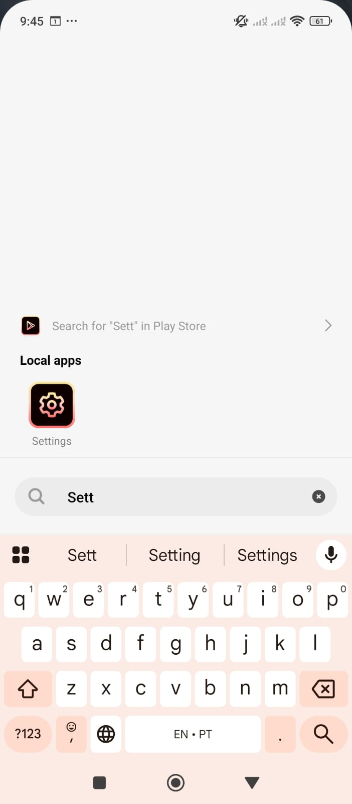
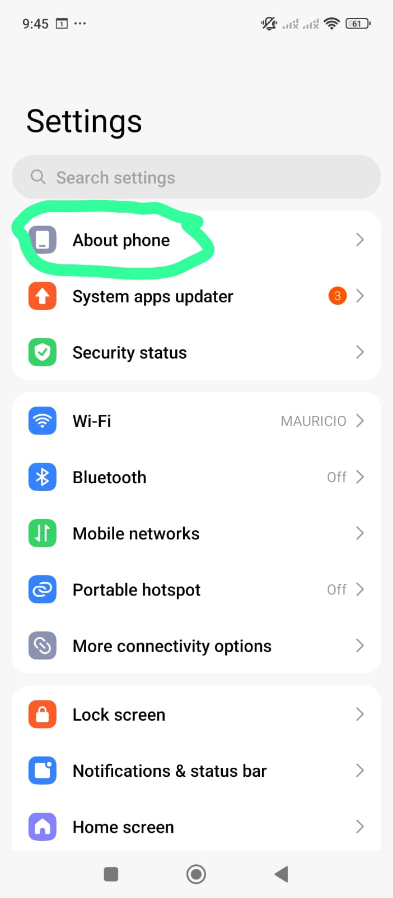
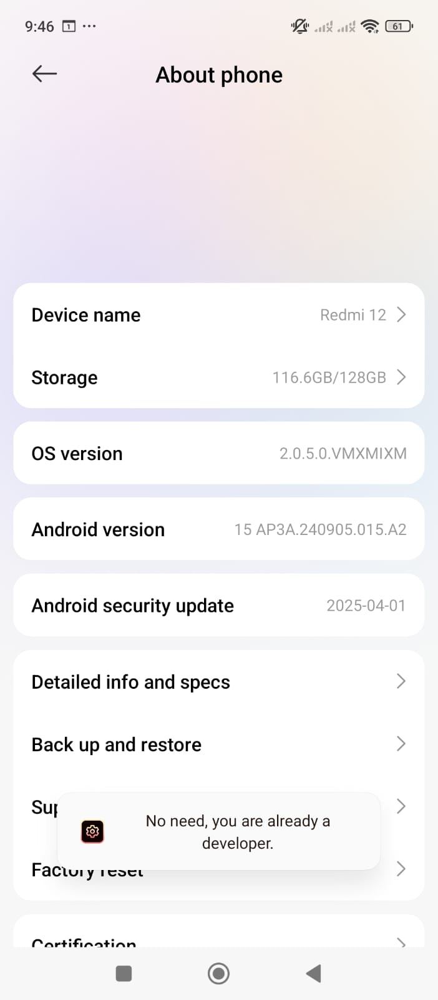
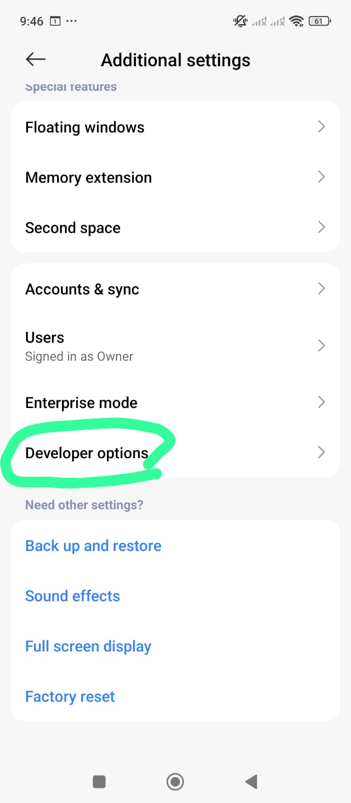
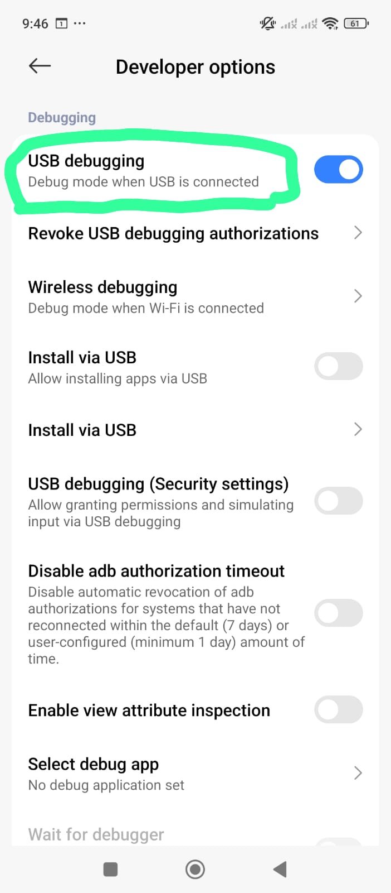

# Usando Flutter sem Android Studio

## ✅ **O que você precisa (sem Android Studio):**

1. **Dispositivo Android com Depuração USB ativada**.
2. **Android SDK** (recomendado) ou apenas os binários ADB + build-tools.

### 📱 Como usar seu próprio celular Android

1. **Ative a opção de desenvolvedor no celular**:

   * Vá em **Configurações > Sobre o telefone > Número da versão**.
   * Toque várias vezes até ativar o modo desenvolvedor.

    
    
    
    

2. **Ative a Depuração USB**:

   * Vá em **Opções do desenvolvedor > Depuração USB**.

    
    
    

3. **Conecte o celular via USB**.

4. No terminal, rode:

   ```bash
   flutter devices
   ```

   Seu celular deve aparecer na lista.

5. Rode o app com:

   ```bash
   flutter run
   ```

### ⚙️ Configurando o ambiente sem Android Studio

Se você **não quiser instalar o Android Studio**, você precisa garantir que o Flutter tenha acesso às **build tools do Android**:

* Instale apenas o **Command Line Tools** do Android:

  * Baixe aqui: [https://developer.android.com/studio#command-tools](https://developer.android.com/studio#command-tools)
  * Extraia e configure a variável de ambiente `ANDROID_HOME`.
  * Instale o SDK e build-tools manualmente com:

    ```bash
    sdkmanager "platform-tools" "platforms;android-33" "build-tools;33.0.2"
    ```

* Adicione ao seu `.bashrc` ou `.zshrc`:

  ```bash
  export ANDROID_HOME=$HOME/Android/Sdk
  export PATH=$ANDROID_HOME/platform-tools:$PATH
  ```
